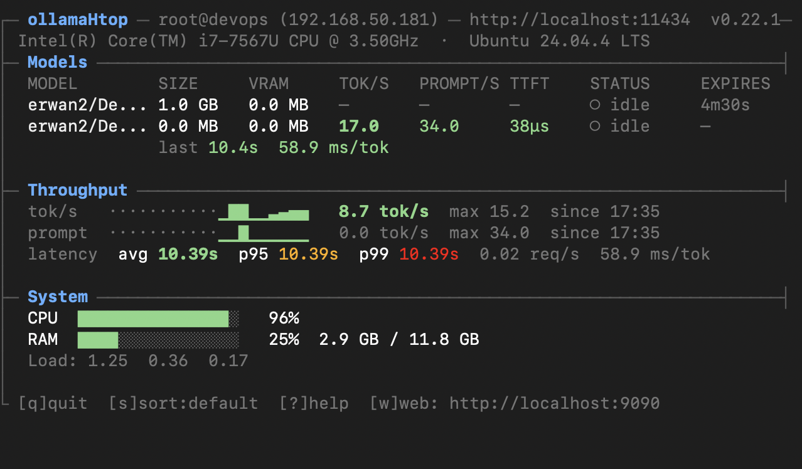
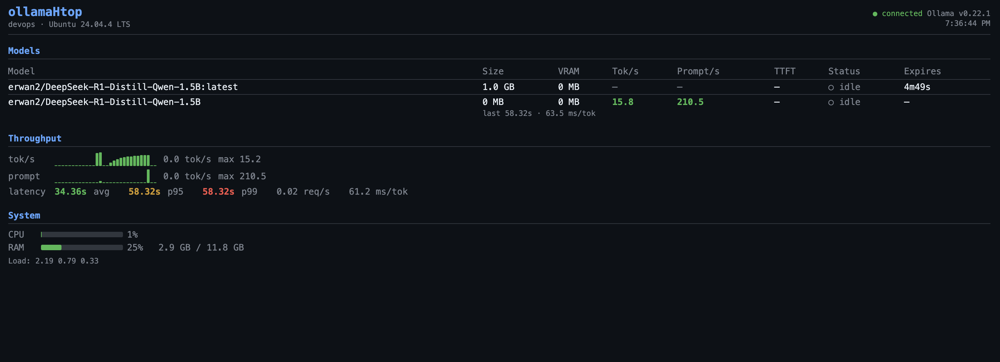

# ollamaHtop

[](https://github.com/mar0ls/ollama_htop/actions/workflows/build.yml)
[](https://ebpf.io)
[](https://github.com/cilium/ebpf)

`htop`-style terminal monitor for [Ollama](https://ollama.com) — real-time tok/s, latency, GPU power, and a built-in web dashboard.  
No proxy, no client changes: a kernel-level eBPF TC hook captures response streams transparently.

## Screenshots

### Terminal (TUI)


*Models loaded, no active requests — model table with expiry countdown, throughput sparklines, latency row, system metrics.*

### Web


*Models table, throughput sparklines with running max, latency avg/p95/p99, req/s, ms/tok, system bars.*

---

## Features

| | |
|---|---|
| **Models table** | VRAM, tok/s, TTFT, status, expiry countdown, last-request latency |
| **Thinking models** | Separate `<think>` phase: tokens, duration, tok/s (deepseek-r1, qwq, …) |
| **Throughput** | 5-min tok/s and prompt/s sparklines with running max |
| **Latency** | avg / p95 / p99 over a rolling 5-min window, req/s, ms/tok |
| **GPU power** | Watt draw and tok/W efficiency — NVIDIA (`nvidia-smi`) and AMD (sysfs) |
| **System metrics** | CPU / GPU / RAM bars with temperature |
| **Web dashboard** | HTML auto-refreshed via SSE, `/api/metrics` JSON endpoint |
| **Transparent capture** | eBPF TC hook — attaches to the kernel, zero Ollama config changes |

## Requirements

- Linux amd64 or arm64, kernel ≥ 6.6 (for eBPF tok/s; basic mode works on any kernel)
- Go 1.24+ (build only)
- Ollama running on the same host

eBPF tok/s requires `CAP_NET_ADMIN` or root.

## Install

Download a pre-built binary from the [Releases](../../releases) page:

```bash
# Linux amd64
curl -L -o ollamaHtop https://github.com/mar0ls/ollama_htop/releases/latest/download/ollamaHtop-linux-amd64
chmod +x ollamaHtop

# Linux arm64
curl -L -o ollamaHtop https://github.com/mar0ls/ollama_htop/releases/latest/download/ollamaHtop-linux-arm64
chmod +x ollamaHtop
```

Or build from source:

```bash
git clone <repo>
cd ollamaHtop
make build          # linux/amd64 → ./ollamaHtop
make build-amd64    # linux/amd64 → ./ollamaHtop-amd64
make build-arm64    # linux/arm64 → ./ollamaHtop-arm64
```

## Usage

```bash
# Basic — model list + system stats (no tok/s)
./ollamaHtop

# Full mode — tok/s, latency, GPU power via eBPF
sudo ./ollamaHtop -ebpf

# Grant capability instead of running as root
sudo setcap cap_net_admin+ep ./ollamaHtop
./ollamaHtop -ebpf

# Remote Ollama host over IPv4 (eBPF attaches to the outbound interface automatically)
sudo ./ollamaHtop -ebpf -host http://192.168.1.5:11434

# Custom web port, debug log
./ollamaHtop -ebpf -web-port 8080 -debug
```

### Flags

| Flag | Default | Description |
|---|---|---|
| `-host` | `$OLLAMA_HOST` or `http://localhost:11434` | Ollama server address |
| `-ebpf` | `false` | Transparent eBPF tok/s (requires root / `CAP_NET_ADMIN`, kernel ≥ 6.6) |
| `-web-port` | `9090` | Web dashboard port (0 = disabled) |
| `-debug` | `false` | Write structured log to `ollamaHtop.log` |
| `-version` | — | Print version and exit |

Without `-ebpf`, tok/s columns show `—` and the Throughput section is hidden.

Remote eBPF traffic capture currently supports IPv4 traffic (not IPv6).

### Keyboard shortcuts

| Key | Action |
|---|---|
| `q` / `Ctrl+C` | Quit |
| `s` | Cycle sort: default → name → tok/s → VRAM → status |
| `?` | Toggle help overlay |

### Web dashboard

Available at `http://localhost:9090` by default.

| Path | Description |
|---|---|
| `/` | HTML dashboard, auto-refreshes via SSE |
| `/api/metrics` | JSON snapshot (same data as TUI) |
| `/api/events` | SSE stream — one event per second |

## How it works

```
┌─ Ollama API poll (1 s) ──────────────────────────────────────────────┐
│  /api/ps → model list, VRAM, expiry                                  │
└──────────────────────────────────────────────────────────────────────┘
                     │
┌─ eBPF TC hook (lo / eth*) ───────────────────────────────────────────┐
│  Captures TCP segments from port 11434                               │
│  Reassembles HTTP body → NDJSON parser                               │
│  Emits: StreamingMetrics (live tok/s, TTFT) + EvalMetrics (done=true)│
└──────────────────────────────────────────────────────────────────────┘
                     │
              aggregator (1 s tick)
               ├─ TUI renderer
               └─ web server (SSE push)
```

The eBPF program attaches via the TCX API (kernel 6.6+). It uses `skb->ingress_ifindex` to handle both loopback (no Ethernet header) and real Ethernet interfaces correctly.

## GPU support

| Vendor | Method | Metrics |
|---|---|---|
| NVIDIA | `nvidia-smi` | utilisation %, temperature, power draw (W) |
| AMD | `/sys/class/drm/*/device` sysfs | utilisation %, temperature, power draw (W) |

GPU power is used to compute **tok/W** — token-per-watt inference efficiency.

## CI

Gitea Actions workflows in `.github/workflows/`:

- **build.yml** — runs on `pull_request` and tag pushes: `go build`, `go test` (≥ 9% coverage), `go vet`, `make bpf-check`, binaries as artifacts.
- **promote-dev.yml** — runs on every branch push; validates, then opens and squash-merges a PR from the branch into `main` (skips `main`/`master`).
- **release.yml** — runs on `v*` tags; builds `ollamaHtop-linux-amd64` and `ollamaHtop-linux-arm64` with the tag as version string, then creates a Gitea release with both binaries attached.

## Comparison

| | ollamaHtop | olltop | Grafana/Prometheus |
|---|:---:|:---:|:---:|
| htop-style TUI | ✓ | — | — |
| Web dashboard | ✓ | — | ✓ |
| eBPF transparent capture | ✓ | ✓ | — |
| p95 / p99 latency | ✓ | — | depends |
| GPU power + tok/W | ✓ | — | depends |
| Thinking-model phases | ✓ | — | — |
| No extra infrastructure | ✓ | ✓ | — |

## License

MIT
